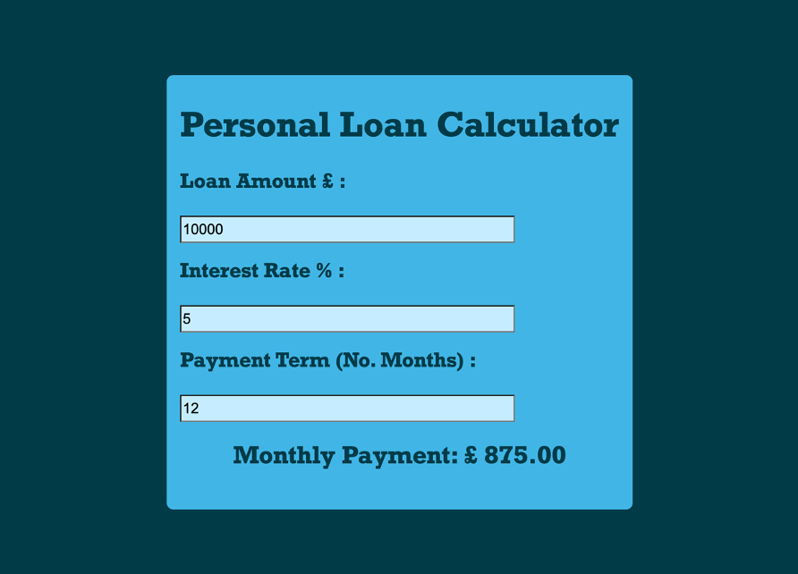
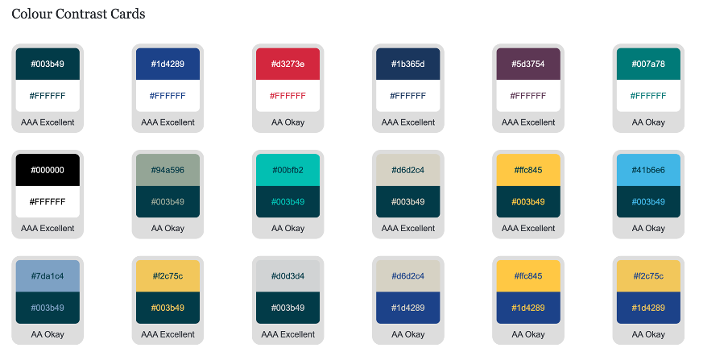
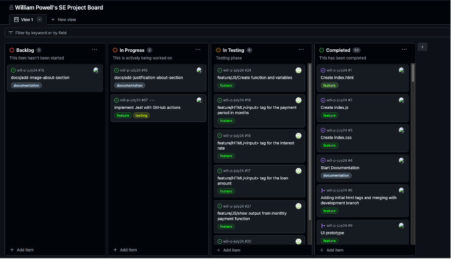
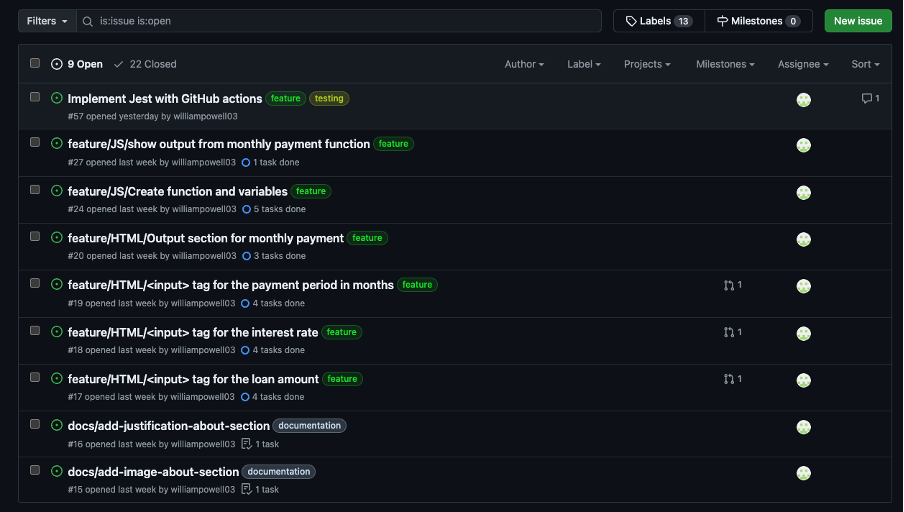

# Software Engineering Summative 1 Assignment
Northeastern University

# Loan Calculator App
[](https://www.codefactor.io/repository/github/williampowell03/will-p-july24)
## About

Author: William Powell

GitHub Username Credentials: @williampowell03



The Personal Loan Calculator App is a Java Script Application that allows the user to calculate the Monthly Payment that arises from a loan of their choosing. The Java Script backend and HTML & CSS front end enables the user to input the loan amount in £, the interest rate % and the payment term length in months, producing an output displaying the monthly payment that the user will incur as a result of the loan.

This application utilises a simple formula in order to calculate the interest and the fixed monthly payment with a user interface that aims to display:
* User input box for the Loan Amount Value
* User input box for the Interest Rate Value
* User input box for the Months to Pay Term
* Output showing the monthly payment for the user

This live web application is deployed using [GitHub Pages](https://williampowell03.github.io/will-p-july24/)

The project is deployed to GitHub pages through the CI/CD or Continuous Integration and Continuous Deployment Pipeline configured to run when a PR is raised for the master (main) branch. The CI/CD Pipelines incorporate automated testing and deployment, enhancing reliability and efficiency throughout the project lifecycle.

Please see more on CI/CD here.

### Justification for application development

The development of the Loan Calculator application is designed to help those looking to manage their finances more effectively. With finance becoming ever more complicated, with an increasing number of people buying homes, funding education or starting a business, an application like this aims to address a common need for individuals. With the understanding of loan terms, interest rates and repayment timelines being complex, this application simplifies the loan process, providing an intuitive and easy to use tool that allows users to quickly and accurately calculate their monthly loan repayment based on variable user inputs. Its development revolves around the objective of enhancing financial accessibility, enabling individuals to plan budgets more effectively, empower informed decision making and avoid potential debt issues, making it invaluable for those considering taking out a loan.

## Documentation

### Running locally:

#### 1. Clone this repo:

```sh
git clone https://github.com/williampowell03/will-p-july24.git
```
Once successfully cloned to a local directory, you have everything needed to run the application. Navigate to index.html, and open in a web browser.

### Running online:

#### 1. Navigate to GitHub Pages

https://williampowell03.github.io/will-p-july24/

Click the hyperlink to navigate to the GitHub hosted application to use online.


### Running all tests during development:

#### 1. Prior to running code, ensure npm is installed using the below command in terminal

```sh
npm install
```

#### 2. To run the pre-defined test cases, run the following command

```sh
npm test
```

This command will run through all test cases in the ___tests___ directory within the repo and produce an output with failed or passed.


## Design

### User Interface Design

I first created my user interface design prototype using Figma, giving me an initial idea for the look of my product. Figma helped when designing the high-level application due to its simple and intuitive interface, enabling anyone to successfully create and design a product to suit their requirements. The choice was made to create initial designs to ease decision making later on in the project and to remove any complexity when implementing the design in CSS. By designing a prototype, it enables me to make subtle changes in the future without changing the entire design if not needed.

[Initial Figma Prototyped Design](https://www.figma.com/design/UPRCPuQzYHB5RXxAl7GTu5/SE-Project-Design?node-id=0-1&t=rHv5oc6k0GHqBgiJ-1)


Click [here](http://www.sussex.ac.uk/tel/resource/tel_website/accessiblecontrast/?q=FFFFFF~003b49~1d4289~94a596~e56db1~d3273e~00bfb2~d6d2c4~ffc845~dc582a~41b6e6~1b365d~be84a3~5d3754~7da1c4~f2c75c~d0d3d4~007a78~000000) to access the website used to identify an accessible colour profile.


## Coding

### Technical Documentation

The application utilises the following technologies:

* HTML: Provides the structure and basic content of the web page.
* CSS: Styles the elements and enhances the visual appeal of the user interface.
* JavaScript: Powers the interactive elements and performs calculations based on user input.

Files used to run the application:
* index.html
* index.js
* style.css

Files used in testing:
* extreme-test.js
* functionality-test.js
* usability-test.js

### Code Implementation

Step-by-step guide on how the MVP was developed:

1.	In index.html, I created the body container class within a division tag and created all of the headings.
2.	I created three user input boxes (tags), allowing the user to input their response depending on the header above each tag.
3.	Towards the end of the container, I created a paragraph tag to show the end monthly payment result that would come from the calculation using the user inputs.
4.	In index.js, I created a function called calculateLoan().
5.	This function contains five variables: loanAmount, interestRate, monthlyTerm, interest, monthlyPayment
6.	The loanAmount variable takes the loan amount in GBP £ from the user input box in index.html
7.	The interestRate variable takes the interest rate percentage % from the user input box in index.html.
8.	The monthlyTerm variables takes the payment term in months from the user input box in index.html.
9.	The interest variable takes in the loanAmount, interestRate and monthlyTerm variables and creates a formula to calculate the accrued interest over the term.
10.	The monthlyPayment variable takes in the loanAmount, monthlyTerm and interest variables and calculates the monthly payment for the user over the given time frame.
11.	This monthlyPayment variable is then outputted using the “payment” ID in index.html displaying ‘Monthly Payment: ${monthlyPayment}’
12.	In style.css, through utilising the classes defined in the html tags, styling like background colour, padding, borders, font styling and text alignment were able to be defined per tag depending on the class. This ensures the product is more accessible and user friendly.


### Continuous Integration and Continuous Deployment (CI/CD)

Continuous Integration (CI) and Continuous Deployment (CD) are important parts of software development, ensuring code quality, reliability, and efficiency throughout the deployment process.

#### CI/CD Pipeline

The Loan Calculator App is deployed online using GitHub Pages, leveraging a CI/CD pipeline triggered automatically when a pull request is made to the main branch. Here’s how the CI/CD pipeline operates:

1.	Testing: Upon a new pull request, automated tests are executed using Jest, a JavaScript testing framework. These tests cover functionality, usability, and extreme value inputs to validate the application's behaviour.
2.	Code Quality Analysis: The CI/CD pipeline includes Codefactor, a tool that assesses the quality of the codebase. It provides insights into code health, adherence to best practices, and potential areas for improvement, providing a score which can be seen at the beginning of the repo README.md.
3.	Deployment: Once all tests pass and code quality meets predefined thresholds, the application is automatically deployed to GitHub Pages. This ensures that the latest version of the Loan Calculator App is always accessible to users.

CI/CD pipelines are crucial for maintaining the integrity of the application throughout its development lifecycle. They streamline the process of testing, integration, and deployment, enabling rapid iteration and quick responses to changes.


## Testing

## Project Management

When managing this Loan Calculator Project, I used the GitHub Projects tool. GitHub project is an adaptable spreadsheet, task-board, and road map that integrates with your issues and pull requests on GitHub, encouraging better and more effective management of the work.



[GitHub Project Docs](https://docs.github.com/en/issues/planning-and-tracking-with-projects/learning-about-projects/about-projects)

To manage this project, I used the Kanban styled board to manage the issue tickets and visualise the project workflow in its varying stages. Issues or tasks can be moved across the workflow depending on their status state. This aligns with the agile approach that I have been taking throughout the different stages of iterative development, ensuring full transparency and incremental software development whilst prioritising tasks efficiently. This encourages continuous improvement, organising tasks into manageable increments, ensuring steady progress and flexibility in responding to changes.

Following the Agile methodology, the Scrum framework was incorporated when developing this application, working in shorter, time-based blocks where a certain amount of work is set to be completed. Due to the shorter scale of the project, Scrum collaborative calls were not necessary but in a larger scale project, this methodology would allow teams to collaborate on tasks and issues more effectively, producing higher quality code with easier manageability, giving the developers more flexibility to adjust project priorities.


### Issue Ticket System

Each ticket in the list of issues corresponds with a task, whether that be a feature, bug, testing or documentation. Every issue is assigned a label and a description to outline what the task is for. An issue will link to a branch and a Pull Request for better management and tracking of the project. Also for audit purposes, the branches can be traced by a ticket. On a larger scale project, a reviewer would be assigned to each PR to ensure that before the branch is merged, it is tested and reviewed to mitigate any risks and identify any potential errors in logic or syntax. For this smaller scale project, I ran the CI/CD pipelines to test, and I reviewed the commit messages individually before merging the branch to reduce any risks of bugs or incidents.




## Evaluation